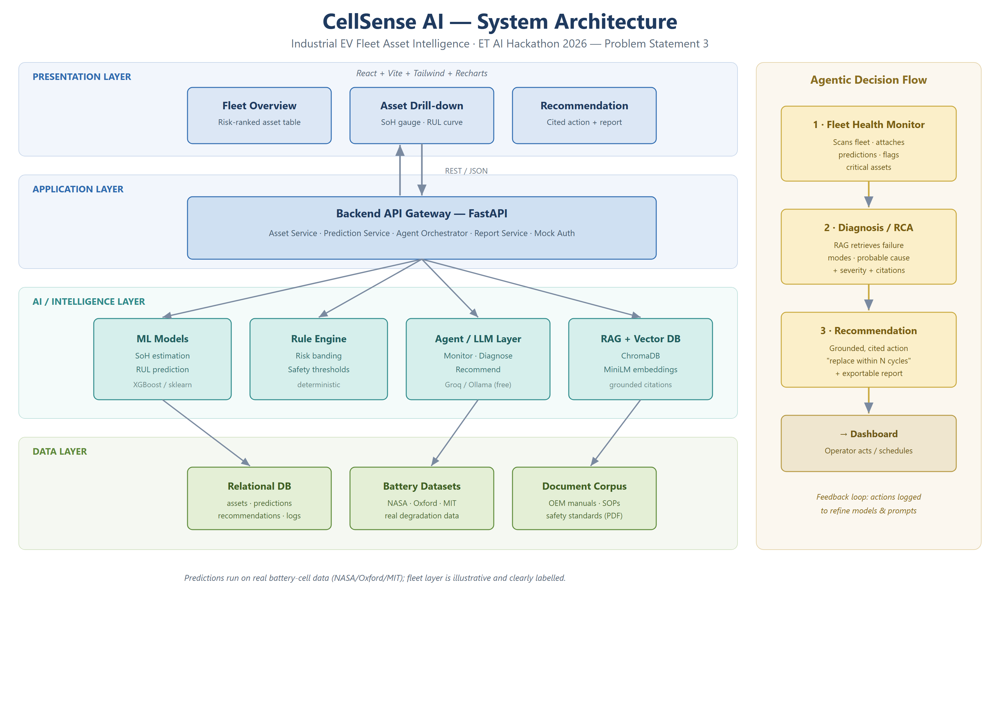

# CellSense AI — Industrial EV Fleet Asset Intelligence

**ET AI Hackathon 2026 · Problem Statement 3 — AI for Industrial EV Supply Chain & Asset Intelligence**

CellSense AI is an **Asset Performance Management (APM)** platform for industrial and commercial EV fleets. It predicts each battery's **State of Health (SoH)** and **Remaining Useful Life (RUL)** from real cell-cycling data, ranks the fleet by risk, and turns every prediction into a **grounded, cited maintenance decision** using a multi-agent reasoning layer over OEM manuals and safety standards.

> The battery is the asset. CellSense AI makes its invisible degradation visible — and actionable.

---

## Key result (Phase P1 — ML core)

Cross-cell evaluation (train on 3 cells, test on a **completely unseen** cell, B0018):

| Model | Metric | Result |
|---|---|---|
| **SoH estimation** | RMSE | **0.0275 SoH** (~2.75% error) |
| | R² | **0.89** |
| **RUL prediction** | RMSE | **16.5 cycles** |
| | R² | **0.74** |

These are **generalisation** numbers — the model never saw the test cell during training. Metrics are written to `models/artifacts/metrics.json`.

---

## Architecture



A provable ML core (SoH/RUL) + a deterministic rule engine (risk banding) + an agentic RAG layer that grounds every recommendation in real documents.

---

## Project structure

```
ET/
├── utils/                    # shared parsing & feature engineering
│   ├── mat_parser.py         #   NASA .mat loader
│   └── features.py           #   health-indicator feature extraction
├── models/
│   ├── training/
│   │   ├── build_dataset.py  #   raw .mat -> processed feature table
│   │   └── train.py          #   train + cross-cell evaluate SoH & RUL
│   └── artifacts/            #   trained models + metrics.json (git-ignored)
├── datasets/                 # raw + processed data (git-ignored, see below)
├── backend/                  # FastAPI service            (Phase P2 — planned)
├── frontend/                 # React dashboard            (Phase P4 — planned)
├── agents/                   # Monitor/Diagnose/Recommend (Phase P3 — planned)
├── rag/                      # document corpus + retrieval(Phase P3 — planned)
├── requirements.txt
└── docs/                     # solution document, diagram, deck
```

---

## Data (not committed — download separately)

The NASA battery data is large (200 MB+) and is **git-ignored**. Download it yourself:

1. Get the NASA PCoE Li-ion Battery Aging dataset:
   `https://phm-datasets.s3.amazonaws.com/NASA/5.+Battery+Data+Set.zip`
   (mirror: [NASA PCoE repository](https://www.nasa.gov/intelligent-systems-division/discovery-and-systems-health/pcoe/pcoe-data-set-repository/) · [Kaggle](https://www.kaggle.com/datasets/patrickfleith/nasa-battery-dataset))
2. Extract the nested zips and place the `.mat` cell files in:
   `datasets/NASA_Battery/mat/` (e.g. `B0005.mat`, `B0006.mat`, `B0007.mat`, `B0018.mat`).

---

## Setup & run

First, download the NASA data into `datasets/NASA_Battery/mat/` (see the Data section above). Then pick one of the options below.

### Option A — one-command scripts (recommended)

**Windows (PowerShell):**
```powershell
.\setup.ps1          # creates .venv and installs everything (run once)
.\run_backend.ps1    # trains models on first run, then starts the API
```

**macOS / Linux:**
```bash
bash setup.sh
bash run_backend.sh
```

`run_backend` auto-trains the models and builds the fleet table on the first run, then serves the API at **http://localhost:8000** (interactive docs at `/docs`).

### Option B — Docker
```bash
cd deployment
docker compose up --build
```
The container trains the models on first start (needs the NASA data on the host) and serves the API on port 8000.

### Option C — manual
```bash
python -m venv .venv
.venv\Scripts\activate                       # Windows  (source .venv/bin/activate on macOS/Linux)
pip install -r requirements.txt
python models/training/build_dataset.py      # processed training table
python models/training/train.py              # train + evaluate (prints RMSE)
python models/training/build_fleet.py        # fleet table for the API
uvicorn backend.main:app --reload --port 8000
```

### API endpoints
| Method | Path | Returns |
|---|---|---|
| GET | `/api/health` | Service status |
| GET | `/api/fleet` | All assets + risk summary (sorted most-urgent-first) |
| GET | `/api/assets/{id}` | Per-asset detail + SoH history curve |
| POST | `/api/assets/{id}/recommend` | Agent pipeline → grounded, cited maintenance recommendation |

### Frontend dashboard (React)

With the backend running on `:8000`, start the dashboard in a second terminal:

**Windows:** `.\run_frontend.ps1`  ·  **macOS/Linux:** `bash run_frontend.sh`

Then open **http://localhost:5173**. The dashboard shows:
- Fleet summary cards (total / critical / watch / healthy)
- A risk-ranked asset table (click a row to inspect)
- Per-asset detail: measured SoH, predicted SoH, RUL, and the State-of-Health degradation curve

The dev server proxies `/api` to the backend automatically (no CORS setup needed).

### AI maintenance recommendations (agent layer)

Clicking **Generate** on an asset runs a three-agent pipeline (`agents/`):
Monitor → Diagnose → Recommend. The Diagnosis agent retrieves supporting text
from the maintenance knowledge base (`rag/corpus/`, TF-IDF retrieval) and the
Recommendation agent produces a grounded, **cited** action.

This works fully offline with **no LLM required** (deterministic, template-composed
text). To have a free LLM polish the prose instead, set one of:

```bash
# Option 1 — Groq free tier
setx GROQ_API_KEY "your_free_groq_key"      # Windows (new terminal after)
# Option 2 — local Ollama (must be running)
#   ollama run llama3.1   (then it is auto-detected at localhost:11434)
```

When a key/model is available the response's `llm_used` flips to `true`; otherwise
the grounded rule-composed recommendation is used. The knowledge base is
**illustrative** — replace the files in `rag/corpus/` with your OEM manuals for production.

---

## Roadmap

| Phase | Scope | Status |
|---|---|---|
| **P1** | Data parsing + SoH/RUL ML core (provable RMSE) | ✅ Done |
| **P2** | FastAPI backend serving fleet predictions | ✅ Done |
| **P4** | React fleet dashboard (risk ranking, drill-down, SoH curve) | ✅ Done |
| **P3** | RAG corpus + 3-agent grounded, cited recommendation | ✅ Done |
| **P5** | End-to-end integration (dashboard ↔ API ↔ models ↔ agents) | ✅ Done |
| **P6** | Pitch deck + demo script | ✅ Done · demo video to record |

---

## A note on data integrity

All predictions run on **real battery-cell degradation data** (NASA PCoE). The fleet
layer (asset IDs, routes, duty cycles) is **illustrative and clearly labelled** — the
machine-learning results are honest and reproducible.

## Team

| Member | Role |
|---|---|
| _[Name 1]_ | ML Lead |
| _[Name 2]_ | Backend + Agents |
| _[Name 3]_ | Frontend |
| _[Name 4]_ | AI/NLP + Integration + Demo |
